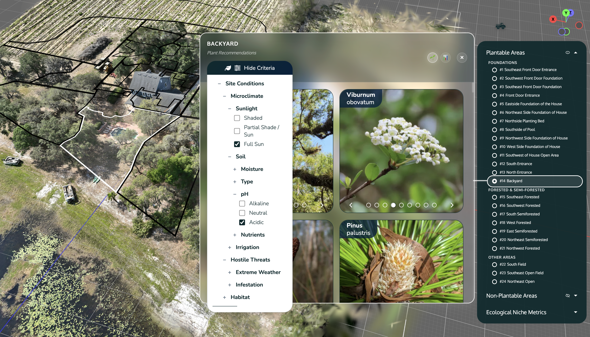
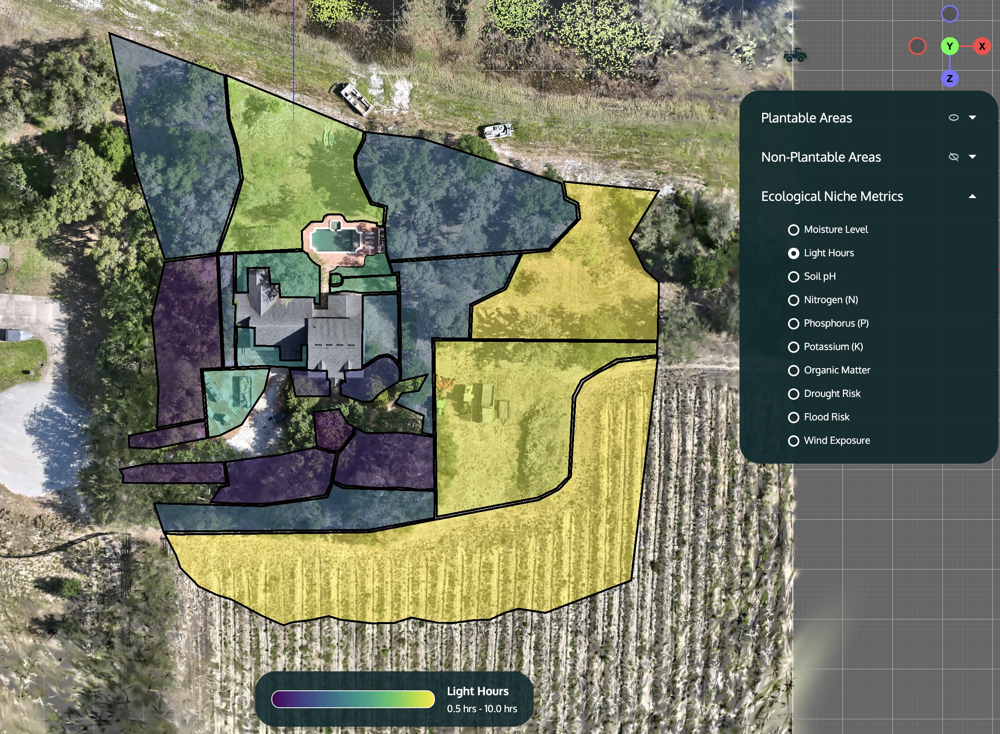
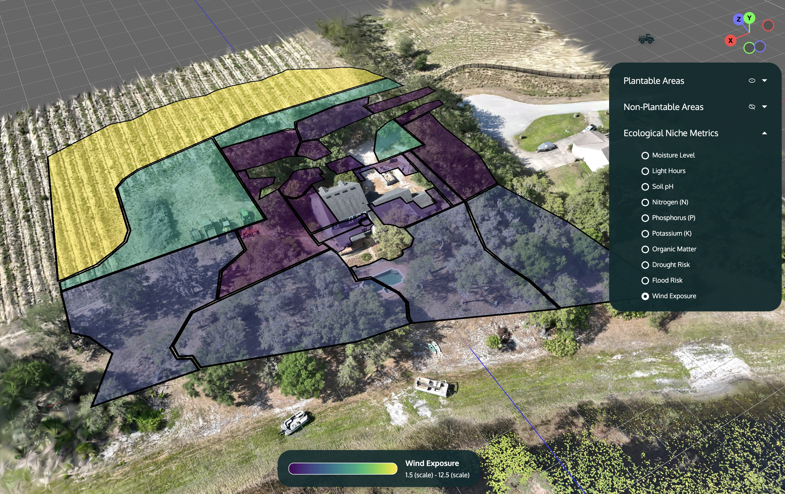

# 3D Ecological Digital Twin Platform


**Ecological Digital Twin Platform for Landscape Design**


This is a 3D visualization platform for landscape designers working with photorealistic digital twins. It integrates 3D Gaussian Splatting with ecological modeling to support native plant-based landscape design decisions.




## 🦋 Platform Overview

### Photorealistic Precision

* 3D Gaussian Splatting uses advanced neural network reconstruction for lifelike rendering
* Geospatially accurate capture from drone and ground surveys
* Minimal visual difference between digital interface and reality


### Landscape Design Tool

* Visualize landscape design proposals through interactive polygon overlays on photorealistic digital twins
* Zero-lag interaction for immersive design experience


### Scientific Model Integration: View ecological metrics as color coded UI overlays

- **Soil Chemistry**: pH, nutrient levels (NPK), and composition analysis
- **Microclimate Mapping**: Solar exposure, moisture gradients, and wind patterns
- **Environmental Risk**: Drought, flood, and extreme weather vulnerability assessment






## 🛠 Installation


### 1. Clone and Setup the Digital Twin Platform

**Requirements**: Python 3.7+, Node.js 18+ and npm


```bash

git clone https://github.com/legel/digitaltwin.git

cd digitaltwin

pip install -r requirements.txt

```


### 2. Build SuperSplat Dependencies

SuperSplat is fully integrated as local files in the `supersplat-build/` directory:


```bash

# One-command setup for SuperSplat (installs dependencies, builds, and deploys)

npm run setup:supersplat

```


Or run individual steps:

```bash

# Install SuperSplat dependencies

npm run install:supersplat


# Build SuperSplat

npm run build:supersplat  


# Deploy built files to serving directory

npm run deploy:supersplat

```


**Fully Decoupled**: All SuperSplat source code is maintained locally in the `supersplat-build/` directory. The SuperSplat application files are built in `supersplat-build/dist/` and copied to `supersplat/` where they are served by the digitaltwin server. No external repositories or complex dependency management required.


### 3. Server File Serving (Already Configured)

The digitaltwin `server.py` serves SuperSplat files through its generic static file route:


```python

# Serve static files (CSS, JS, images) - includes SuperSplat files in supersplat/ directory

@app.route('/<path:path>')

def serve_static(path):

    return send_from_directory('.', path)

```


This automatically serves SuperSplat files from the `supersplat/` directory, allowing the digitaltwin interface to load SuperSplat in iframe mode at `/supersplat/index.html`.


### 4. Start Development Server

```bash

python server.py

# Open http://localhost:5001

```


**Development Environment**: Direct file editing with browser refresh. No complex build pipeline required.


### Troubleshooting

- Requires Node.js 18+ and npm for building from source
- Files are served from `supersplat/` directory, make sure to copy the contents of 'supersplat-build/dist/' there after building
- If a Gaussian Splat is not loading, the server hosting it may be down


## 🔬 Technical Specifications


- Built on PlayCanvas rendering engine with integrated SuperSplat for 3D Gaussian Splatting
- Uses .ply format for Gaussian splat data and GeoJSON for polygon geometry
- Hardware-accelerated polygon rendering with the PlayCanvas API
- Modular JavaScript architecture with manager-based pattern for state management and event coordination


## 🌍 Mission Alignment


The digital twin platform directly supports Ecodash's mission to **"Cultivate thriving ecosystems across the planet through computational ecology and human creativity"** by providing:


- **Design Intelligence**: Tools that translate ecological science into actionable landscape design
- **3D Ecological Digital Twins**: Photorealistic simulations showing landscapes across seasons


## 🚀 Future Work


Active development continues to enhance the ecological digital twin platform for landscape professionals. Key priorities include:

* **Supply Chain Integration**: Direct connectivity with native plant nurseries, enabling designers to specify plants based on ecological suitability and verify real-time availability
* **Design Annotation System**: Interactive markup tools for polygon overlays, allowing landscape architects to document design rationale and visualize implementation phases
* **Enhanced Photorealism**: Higher resolution Gaussian splat reconstruction pipelines for improved visual fidelity and design precision


## 📄 License


Copyright Ecological Intelligence, Inc.


## 🙏 Acknowledgments


- **[SuperSplat](https://github.com/playcanvas/supersplat)**: Advanced 3D Gaussian Splat rendering and visualization
- **Native Plant Community**: Growers, researchers, and designers preserving genetic heritage
- **Landscape Professionals**: Practitioners shaping millions of acres annually for ecological function


